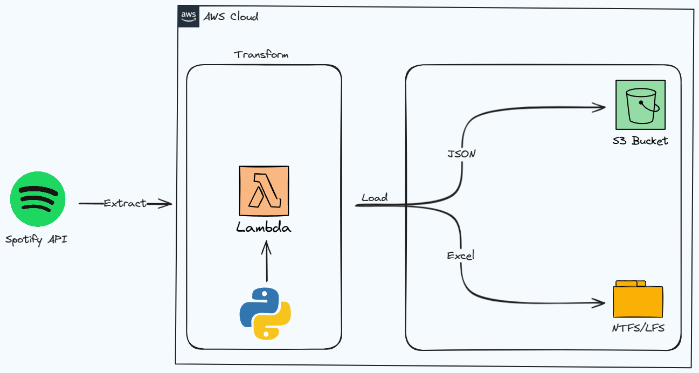

# Spotify Data ETL Project

## Overview
This project is designed to perform Extract, Transform, and Load (ETL) operations on data from Spotify. It focuses on extracting data from Spotify's API, transforming the data as per needs, and eventually load the semi-structured data into an AWS S3 bucket or export the structured data to Excel for further analysis.




## Components
1. **SpotifyDataETL.py**: This Python script handles the extraction of data from the Spotify API, its transformation, and uploading the processed data to AWS S3.
2. **SpotifyDataETL-TO-EXCEL.ipynb**: A Jupyter notebook that performs similar operations as the Python script but directs the output into structured Excel files for easy accessibility and analysis.

## Prerequisites
- Python 3.x
- Access to Spotify API (Spotify Developer Account)
- AWS Account (for S3 bucket access)
- Relevant Python packages: `spotipy`, `pandas`, `boto3` (Install via `pip install spotipy pandas boto3` if you so desire to do some local testing)

## Technologies Stack
- Python 3.x
- AWS Cloud
  - Lambda
  - S3 (Simple Storage Service)
- Spotify Web API

## Configuration
Set up the necessary credentials for Spotify API and AWS S3 in environment variables or within the scripts as applicable:
- Spotify API: Client ID, Client Secret, and Redirect URI.
- AWS: Access key ID and Secret access key.

## Installation

1. Clone the repository and install the required Python packages:
```bash
git clone https://github.com/Eckesaht/data-engineering-spotify.git
```
2. Set up your AWS Lambda environment
3. Do it!

## Usage
- etl_to_s3_bucket.py: Run this script to fetch data from the Spotify API, process it and upload to the configured AWS S3 bucket.
- etl_to_excel.ipynb: Open this Jupyter notebook in your Jupyter environment and run the cells to perform the ETL process and save the data into Excel files.
